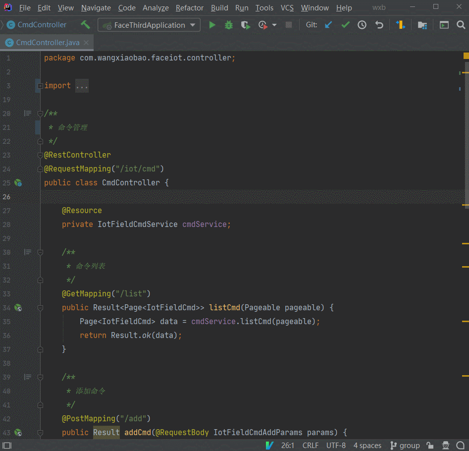

# Apidocx
> 本项目已收录到[YApi](https://github.com/YMFE/yapi), [Rap2](https://github.com/thx/rap2-delos)官方仓库

**一键生成API接口文档, 上传到YApi, Rap2, Eolink等平台的IDEA插件.**

**亮点**
- 零成本: 支持主流框架、编写标准Javadoc就可以生成很好的API文档。
- 智能规则: 内置mock规则，可以生成很好的Mock数据。
- 交互友好: 支持账户密码登录，单方法、单类、多类、整个项目上传接口文档。

**特性**

- [x] 上传文档YApi、Rap2、Eolink、ShowDoc、Apifox平台
- [x] 导出文档OpenAPI、Markdown、cURL格式
- [x] 支持主流框架Spring MVC、Spring Flux、Jackson、JSR303、Swagger注解

## 使用
1. 安装: 打开Idea -> File -> Settings -> Plugins, 搜索: Apidocx（原名: Yapi X）
2. 配置: 项目根目录创建".yapix"文件, 内容: yapiProjectId=110
3. 上传: 光标放置在你的控制类或方法，右键执行: Upload To YApi ( 提示：如果未填登录信息，会弹窗提示 )

更多：[十分钟使用指南](docs/GUIDE.md)

## 交流
欢迎提出您的发现问题、需求、建议、以及提交代码来参与贡献。
- QQ交流群：860701800

提示：如果您准备为该插件开发一个新功能，请先通过issues讨论，避免重复开发。

## 捐赠
非常感谢您使用Apidocx，如果贵公司有非通用的定制开发需求，可提供有偿定制开发服务。
